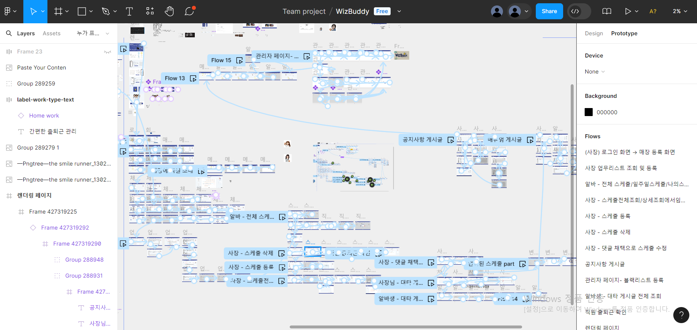
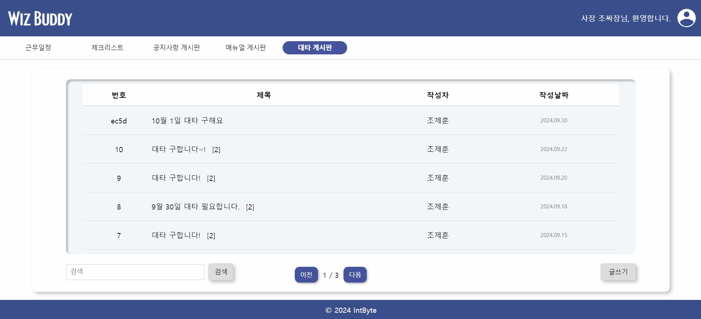
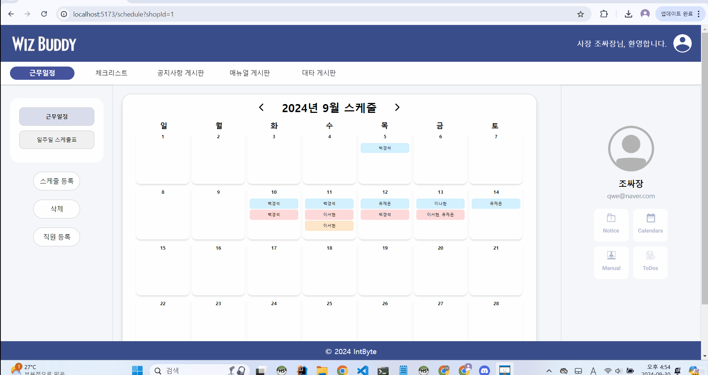
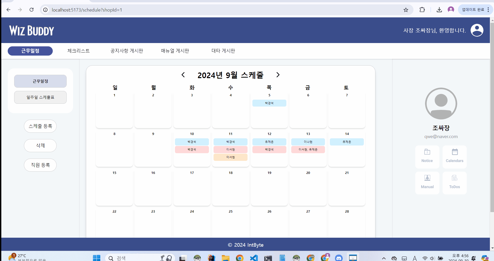
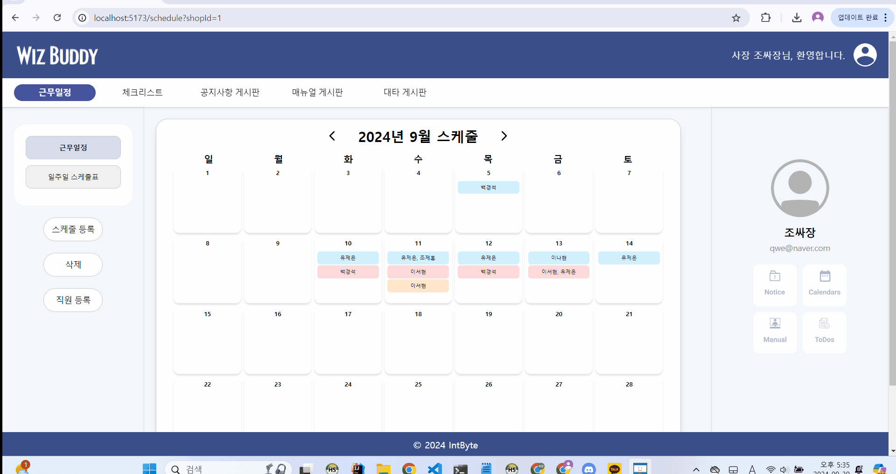
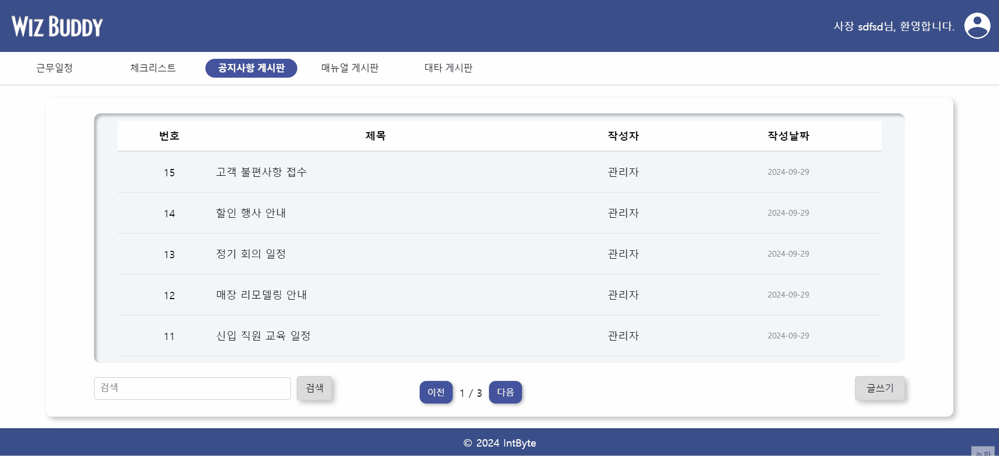
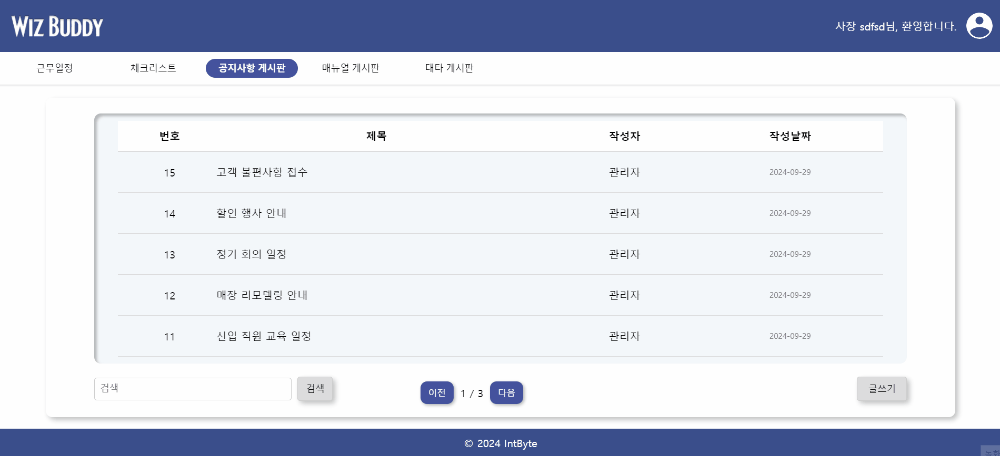
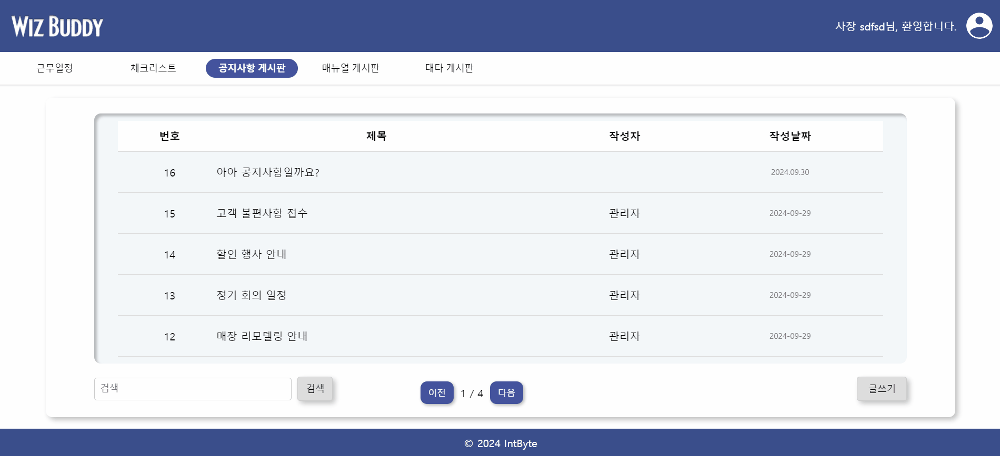
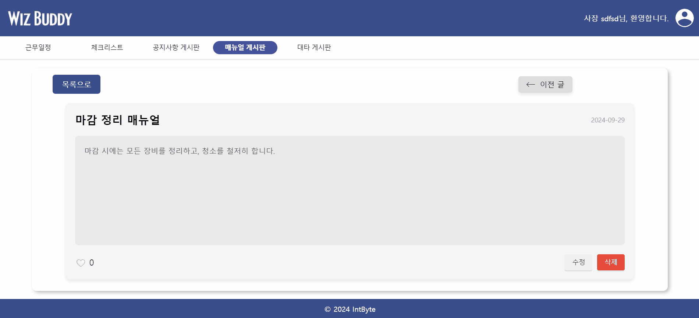
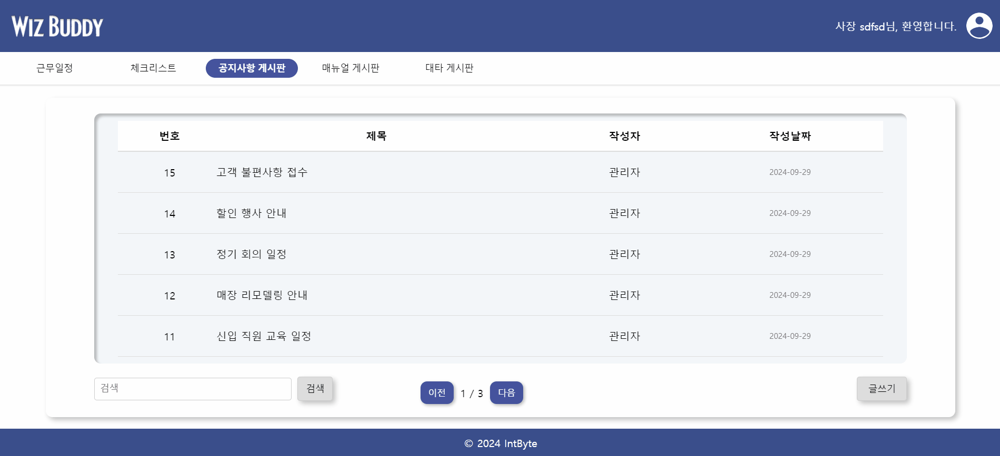

# 🔗 위즈버디 _ WizBuddy

 
 

# 🐼 Group 4 Team Member - `Int4_Byte`

|  |  |  |  |  | 
| :----------------------------------------------------------: | :----------------------------------------------------------: | :----------------------------------------------------------: | :----------------------------------------------------------: | :----------------------------------------------------------: |
|                            조제훈                            |                            백경석                            |                            유제은                            |                            이나현                            |                            이서현                            |
|   ` ESFJ `|   ` ENTP `|   ` INFP `|   ` ENTJ `|   ` INFJ `|

  

# 🛠️ Technical Stack
## Frontend

## ⚙ Tool
 &nbsp;
 &nbsp;

  

#  🚩 프로젝트 개요
## :one: 프로젝트 소개
사장님과 아르바이트생을 위한 스마트 매니지먼트 솔루션, **WIZ BUDDY**  
- **W(Work)**: 업무 효율을 극대화하는 최적의 파트너  
- **I(Instant)**: 즉시 문제를 해결하고 소통을 원활하게  
- **Z(Zero)**: 스트레스 없이 모든 업무를 간편하게 관리  

## :two: 프로젝트 필요성
### 1. 사장님
  
- 23년 12월 매장을 운영하고 있는 사장님을 대상으로 설문조사를 시행한 결과, 아르바이트생의 근태관리가 사업장을 운영할 때 어려운 점 1위로 선정되었습니다.
- 이를 바탕으로, 사장님들은 매장을 운영하면서도 아르바이트생도 관리해야 한다는 어려움을 겪고 있는 것을 알 수 있었습니다.

### 2. 아르바이트생
  
- 아르바이트를 할 때, 대부분의 사업장에서 공지사항 전달, 스케줄 관리를 위해 카카오톡을 사용합니다.
- 20년 12월 아르바이트생을 대상으로 한 설문 조사 결과 5명 중 4명이 단톡방으로 인해 스트레스를 받는다는 결과를 볼 수 있었습니다.  

- 이를 통해 카카오톡이 아닌 다른 곳에서 아르바이트 관련 전달사항, 업무 등을 처리할 수 있는 서비스가 필요해 이 서비스를 기획하였습니다.
- 사장님은 아르바이트생의 근태, 스케줄, 업무 관리를 한 곳에서 수행할 수 있습니다.
- 아르바이트생은 일상과 업무를 분리할 수 있고, 스케줄 조정, 공지사항, 업무 체크리스트 등의 기능을 통해 업무를 더욱 효율적으로 수행할 수 있습니다.

## :three: 유사 서비스 및 차별화 전략
### 1. 워키도키
  
- 아르바이트 추천, 업무 체크리스트 등의 기능 제공

### 2. 샵솔
 
   
- 출퇴근 관리, 자동 급여 계산, 급여 명세서, 체크리스트, 업무일지, 바코드 인식을 통한 유통기한 관리 등의 기능 제공

### 3. 차별화 전략

## :four: 프로젝트 주요 기능
### 1. 업무 체크리스트
- 사장님의 입장에서는 아르바이트생이 업무를 제대로 수행하고 있는지 쉽게 확인이 가능하고, 아르바이트생의 입장에서는 어떤 업무를 해야 하는지 빠르게 파악이 가능합니다.
    
### 2. 업무 캘린더
- 사장님이 일주일 근무 스케줄을 게시하면 아르바이트생들은 근무 일정을 한 눈에 확인할 수 있습니다.
    
### 3. 스케줄 조정 기능
- 아르바이트생들은 사장님께 일일이 전달하지 않고도 다른 아르바이트생들과 서비스 내에서 쉽게 스케줄을 변경할 수 있습니다.

  

# 🚩 WBS
### [🔗 WBS 바로가기](https://docs.google.com/spreadsheets/d/11AirCDIcRRg-C22BVh2cYn6UemvdJoVKG5yCrohsYk4/edit?gid=1661620539#gid=1661620539)
 

  

# 🚩 요구사항
### [🔗 요구사항 정의서 바로가기](https://docs.google.com/spreadsheets/d/11AirCDIcRRg-C22BVh2cYn6UemvdJoVKG5yCrohsYk4/edit?gid=0#gid=0)
 

  

# 🚩 Figma

 
🎥 Figma 및 Prototype Page

 

📜 스토리보드

이 시스템은 사용자들이 매장을 관리하고 업무를 효율적으로 수행할 수 있도록 다양한 CRUD 기능을 제공하는 웹 애플리케이션입니다. 첫 번째 페이지는 **렌더링 페이지** 로, 사용자가 로그인 및 회원가입 화면으로 이동할 수 있는 진입점을 제공합니다. 이 페이지에는 로그인 버튼, 회원가입 버튼, 그리고 메인 로고와 소개 텍스트가 포함되어 있습니다. 사용자는 로그인 또는 회원가입 버튼을 클릭해 해당 페이지로 이동할 수 있습니다.
  

**로그인 및 회원가입 페이지**에서는 사장 또는 직원이 시스템에 로그인하거나 새로운 계정을 등록할 수 있습니다. 로그인 페이지에는 아이디와 비밀번호 입력 필드, 로그인 버튼, 회원가입 링크가 있으며, 로그인에 성공하면 매장 리스트 화면으로 이동합니다. 회원가입 페이지에서는 아이디, 비밀번호, 이름, 그리고 역할(사장 또는 직원)을 선택하는 필드와 회원가입 버튼이 제공됩니다. 회원가입이 완료되면 로그인 화면으로 이동하게 됩니다.

**매장 리스트 화면**에서는 사장이나 직원이 자신의 매장을 조회하거나, 사장은 새로운 매장을 등록하고 기존 매장을 수정하거나 삭제할 수 있습니다. 화면에는 매장 이름과 매장 주소로 구성된 매장 리스트가 표시되며, 사장 전용으로 매장 등록, 수정, 삭제 버튼이 제공됩니다. 직원은 자신이 속한 매장을 조회만 할 수 있으며, 매장을 선택하면 체크리스트 화면으로 이동하게 됩니다.

**사장의 매장 관리** 기능은 매장을 등록, 수정, 삭제할 수 있는 페이지입니다. 매장 등록 페이지에서는 매장 이름, 주소, 연락처를 입력할 수 있는 필드와 등록 버튼이 제공되며, 입력한 정보가 서버에 저장되면 매장 리스트 화면으로 돌아가게 됩니다. 매장 수정 시 기존 정보가 수정 화면에 미리 입력되어 있으며, 삭제 버튼을 클릭하면 해당 매장이 삭제되고 매장 리스트 화면으로 돌아갑니다.

**체크리스트 화면**에서는 매장 내에서 일별 업무나 확인할 사항을 관리할 수 있습니다. 체크리스트 아이템으로 업무 항목이 나열되어 있으며, 사장과 직원 모두 체크리스트 항목을 추가하거나 완료할 수 있습니다. 체크 항목 추가 버튼이 제공되며, 완료된 항목은 체크박스로 표시됩니다.

**업무 리스트**에서는 매장 내에서 해야 할 구체적인 업무를 관리할 수 있습니다. 각 업무는 담당자와 상태가 표시되며, 사장은 업무를 추가하고 직원별로 지정할 수 있습니다. 사장은 업무의 상태를 수정하거나 완료 처리를 할 수 있으며, 직원은 자신에게 할당된 업무를 확인하고 그 상태를 업데이트할 수 있습니다.

**스케줄 화면**은 직원들의 근무 스케줄을 관리하는 곳으로, 주간 스케줄 테이블을 통해 요일별로 근무자의 이름과 근무 시간을 확인할 수 있습니다. 사장 전용으로 스케줄 추가 버튼과 수정 및 삭제 기능이 제공되며, 사장은 직원별 스케줄을 등록하고 수정할 수 있습니다. 직원은 자신의 스케줄을 확인할 수 있습니다. 또한 대타 게시판과  연관지어 스케줄 근무 타임을 선택한뒤 이에 대한 날짜의 대타를 구할 수 있는 대타 게시판으로 게시판 자동 등록과, 대타 게시판의 댓글 채택 시  그날의 근무자가 채택된 댓글의 작성자 가 스케줄 표에 자동 수정됩니다.

위에서 말한 **대타 게시판 화면**에서는 사장 또는 직원이 근무 가능한 대타 인력을 구인하거나 지원할 수 있습니다. 대타 구인 게시글 리스트가 제공되며, 구인 글 작성 버튼을 통해 필요한 날짜와 시간, 조건을 입력할 수 있습니다. 직원은 해당 글에 지원할 수 있는 버튼이 제공되어, 자신이 대타로 근무할 수 있음을 알릴 수 있습니다.

**공지, 메뉴얼 게시판**은 직원 간 또는 사장과 직원 간의 소통을 위한 공간입니다. 게시글 목록에는 제목, 작성자, 작성일이 표시되며, 사장과 직원 모두 게시글을 작성할 수 있는 버튼이 제공됩니다. 각 게시글에 좋아요를 표함으로써 게시글의 호의와 확인 유무를 알 수 있습니다. 또한 매장 운영하는데 원활한 소통이 됨을 알 수 있습니다.

마지막으로, **관리자 페이지**는 관리자가 시스템을 모니터링하고 필요한 설정을 관리할 수 있는 곳입니다. 전체 사용자 목록과 매장 리스트가 제공되며, 관리자는 시스템 설정을 통해 매장 최대 등록 수나 사용자 권한 등을 관리할 수 있습니다. 특정 사용자나 매장을 삭제할 수 있는 권한도 포함됩니다.

  

# 🚩테스트 계획 및 결과 보고서

## 📍 00_rendering Page

 
렌더링 페이지

 

## 📍 01_user Page

 
사장 회원가입

 
사장 로그인

 
직원 회원가입

 
 

 
직원 로그인

  

## 📍 02_shop Page

 
사장 로그인

 
매장 등록

 
매장 수정

 
매장 삭제 요청

 
사장-직원 초대

 
직원-초대 수락

## 📍 03_employee per shop Page

 
13번 직원 회원가입

 
13번 직원 로그인

 
매장별 직원 등록

 
매장별 직원 전체 조회

 
매장 내 직원 정보 조회

 
직원이 속한 매장 리스트 조회

 
매장별 직원 수정

 
매장별 직원 삭제

## 📍 04_subs board Page

 
대타 게시글 전체 조회

 
대타 게시글 1개 조회

 

 
대타 게시글 등록

 
대타 게시글 수정

 
대타 게시글 삭제

## 📍 05_comment Page

 
게시글 별 댓글 전체 조회

 

 
게시글 별 댓글 등록

 

 
게시글 별 댓글 수정

 

 
게시글 별 댓글 삭제

## 📍 06_schedule Page

 
전체 스케줄 조회, 한 주의 스케줄 조회

 
직원 별 한 주의 스케줄 상세 조회 (추후 추가 예정) 

 
한 주의 스케줄-스케줄 등록

 

 
한 주의 스케줄-직원 등록

 
스케줄 수정

  

 
댓글 채택으로 스케줄 수정 (추후 추가 예정)

 
스케줄 삭제

## 📍 07_manual board Page

 
매뉴얼 게시판 전체 조회

 
매뉴얼 게시글 단 건 조회

 

 
매뉴얼 게시글 등록

 
매뉴얼 게시글 수정

 
매뉴얼 게시글 삭제

## 📍 08_notice board Page

 
공지사항 게시판 전체 조회

 
공지사항 게시판 단 건 조회

 
공지사항 게시글 등록

 
공지사항 게시글 수정

 
공지사항 게시글 삭제

## 📍 09_like Page

 
 
매뉴얼 게시글 좋아요 등록

 

 
공지사항 게시글 좋아요 등록

 

## 📍 10_task, checklist Page

 

  (고정, 비고정)업무 등록 및 조회
 

  

 

  체크리스트 등록 및 조회
 

  

 

  체크리스트 수정 및 삭제
 

  

 

  체크리스트 업무 완료표시
 

 

 

  업무 수정
 

 

 

  업무 삭제
 

 

 

  role에 따른 다른 화면 구성
 

 

 
 

# 🚩추후 보완 사항

 
 
# 📜 동료평가
**1. 조제훈**

|Team Member| 동료평가                                                                                                                                                                                                                                                                            |
| :--------------------------------------: |---------------------------------------------------------------------------------------------------------------------------------------------------------------------------------------------------------------------------------------------------------------------------------|
|  백경석  | 항상 많은걸 배우는 친구입니다. 서현님과 동일하게 제가 프로젝트 감을 못잡고 진행을 못하고 있을때 제게 많은 도움을 준 친구입니다. 프론트엔드의 캘린더 API를 위해 자진하여 스케줄 엔티티를 담당하여 완성도 높은 스케줄 관리 로직을 구현해냈습니다. 같은 팀을 하며 더 많이 배우고 싶습니다.                                                                   |
|  유제은  | 알고있는게 많아서 모르는게 있는 팀원들을 나무라지않고 잘챙기는 모습이 인상적이었습니다. 팀장이 없는 프로젝트였지만 팀장을 뽑으라고 한다면 뽑고 싶을 정도로 리더십도 뛰어나고 책임감도 뛰어난 분이십니다 ^^bb 논리모델링을 정말 잘하고 본인도 좋아하는 것 같았어요 **헤헤티비**. 그리고 제가 깃허브 실수를 한적이있습니다... 기가 그냥 팍 죽어있었는데 본인도 그런 적이 있다며 원래 그런거라며 말씀해주셔서 감동*100 먹었습니다... 패치커밋풀푸시를 죽을때까지 잊지 못할 것 같습니다 |
|  이나현  | 다른 사람들의 의견에 귀 기울이고 존중해줌으로써 팀을 이끄는 능력이 뛰어납니다. 어려움이 생기면 침착하게 도움을 주며, 팀원들이 끝까지 함께할 수 있도록 끝없는 칭찬과 함께 격려해주는 따뜻한 청년입니다. 먼저 한마디를 전달하려고 해도 상대를 존중해주는 느낌을 받아 모두가 서로를 배려하고 정말 재미있고 기억에 남을 백엔드 파트를 끝맺은것 같습니다.                                                                              |
|  이서현  | 오류를 포기하지 않고 해결하려고 끝까지 노력하는 모습을 본받고 싶습니다.                                                                                                                                                                                                                                        |

**2. 백경석**

|Team Member| 동료평가                                                                                                                                                                                                               |
| :--------------------------------------: |--------------------------------------------------------------------------------------------------------------------------------------------------------------------------------------------------------------------|
|  조제훈  | 같이 프론트엔드를 하면서 처음 하는 것이라 많이 막막하기도 했지만 열심히 공부하고 직접 끝까지 해내는 모습을 보고 많은 생각이 들게 해주었습니다. 고마워요??                                                                                                                           |
|  유제은  | 팀원이 실수한걸 밤새 수습하며 화 한번 내지 않는 천사입니다. . .정리를 잘해서 본인이 맡은 부분을 다른 팀원들이 이해하기 쉽게 해줍니다 ㅎㅎ 노션에 오류난 부분을 해결해나가는 과정을 정리해놓은게 도움이 많이 됐습니다람쥐돌이 모르는게 있다고하면 "방송켜~!!!" 라고 하며 직접 화면을 보면서 해결해줍니다 짱이에요 타자도 엄청 빠릅니다 눈깜짝할사이에 메소드 하나가 완성됩니다 |
|  이나현  | 팀원들의 요청에 언제나 응답하며, 끝까지 도움을 아끼지 않는 착한 청년입니다. 하나에 대해 이해도가 우사인볼트급으로 빨라 핵심을 잘 캐치해줌으로써 팀의 결속력을 높여 모두가 끝까지 함께할 수 있도록 힘을 북돋아줬습니다. 에너지 음료가 필요없을만큼 때로는 묵묵하고 때로는 유머를 선사해주고, 모두에게 에너지를 전달하며 팀 전체가 행복하게 잘 마무리 할 수 있어서 좋았습니다.   |
|  이서현  | 막히는 부분이 있을 때 질문하면 빠르게 해결하는 것이 큰 도움이 되었습니다.                          |

**3. 유제은**

|Team Member| 동료평가                                                                                                                                                                                                                          |
| :--------------------------------------: |-------------------------------------------------------------------------------------------------------------------------------------------------------------------------------------------------------------------------------|
|  조제훈  | 조제훈님은 선생님이 시작전부터 제일 어려울거라고 말한 캘린더 파트를 먼저 하겠다고 나서준 고마운 친구입니다.                                                                                            |
|  백경석  | 백경석님은 모르는게 나오면 절대 그냥 넘어가지않고 무조건 찾아서 이해하고야마는 집착남입니다... 멋있습니다...                                             |
|  이나현  | 이나현님은 아무도 생각못한 랜더링페이지를 제일먼저 찾아와서 만들어줘서 저희의 프로젝트가 좀 더 퀄리티 있어 보이게 해주었습니다 그리고 진행속도가 더뎌질때마다 방향을 잡아주는 역할도 해주었습니다. 이나짱 존경해요? 알라뷰? |
|  이서현  | 오류가 난 부분을 직접 해결하고 노력하는 모습이 보기좋았습니다. 마지막까지 해결하려고 붙잡고있다가결국에 해내고 얏호 소리를 지르는 모습이 기억에 남습니다.                    |

**4. 이나현**

|Team Member| 동료평가                                                                                                                                                                                                                                                   |
| :--------------------------------------: |--------------------------------------------------------------------------------------------------------------------------------------------------------------------------------------------------------------------------------------------------------|
|  조제훈  | 프론트엔드를 다뤄본 점이 잘 드러나 어려운 파트를 맡아서 잘 적어줘서 고마웠습니다. 덕분에 다른 부분에 치중해서 열심히 할 수 있었고 즐거웠습니다. 고마워요??                                                                                                                                                              |
|  백경석  | 무려 천줄 가량의 welcome 페이지를 작성하고 많은 피그마 디자인을 제작한 친구입니다. 누구보다 피그마 제작에 열성적이었고 그만큼 완벽도가 높은 디자인을 뽑아낼 수 있었습니다. 팀원이 빼먹은 부분도 잘 잡아내고 발표에서 좋은 평가를 받은 본받고 싶은 친구입니다.                                                             |
|  유제은  | 역시 MBTI J답게 해야할 일을 척척 정리해서 말해줘서 프로젝트 진행 기간동안 편했습니다 팀프로젝트를 할때 한 명쯤 꼭 필요한 인원이라고 생각해요!! 집이 제일 먼데도 불구하고 남아서 같이 하고 가줘서 고마웠어용 항상 귀엽게 웃어줘서 팀 분위기가 너무 좋았어요 이나짱 최고야  디자인 감각도 뛰어나서 저희 프로젝트의 프로필이 될 이미지를 뚝딱 제작해주는 것이 이미지 생성 AI가 필요없을 정도입니다 아직 인간시대의 끝은 도래하지 않았습니다 |
|  이서현  | 항상 기발한 아이디어를 내서 json 서버 연결 및 오류 해결에 많은 보탬이 되었습니다.                                         |

**5. 이서현**

|Team Member| 동료평가                                                                                                                                                                                                                                                                 |
| :--------------------------------------: |----------------------------------------------------------------------------------------------------------------------------------------------------------------------------------------------------------------------------------------------------------------------|
|  조제훈  | 개념을 굉장히 열심히 공부해 응용하려고 노력한 팀원으로, 뭣하나 허투루 하지 않고 열심히 해주는 모습을 본받고 싶었습니다..! 고마워요??                                                                                                                                                                                        |
|  백경석  | 프론트엔드에 굉장한 재능을 가지고 있습니다. 기초 설계 단계에서부터 vue.js의 컴포넌트 분할에 이르기까지 여러개의 Board를 하나의 컴포넌트로 처리하는것이 인상깊었습니다. 처음에 vue.js의 구조에 대해 이해를 잘 못하고 있을때 서현님께서 간략한 구조를 설명해 주셨고 덕분에 컴포넌트와 뷰의 차이를 이해할 수 있었고 잘 구분해서 적용할 수 있었습니다. 데브옵스 프로젝트때도 많은 도움을 받고싶습니다.                                                                  |
|  유제은  | 모르는 부분은 어디를 모르는지 제대로 물어보고 배우고자 하는건 뒤에 서서라도 듣는 모습을 보고 책임감이 뛰어난 분이라고 생각했씁니다 해야 할 일을 다하고나서도 가만히 있지않고 다른 일을 찾아서 할 줄 아는 분이고 이분도 역시 정리를 잘하십니다!! 깃허브 리드미를 아주 멋지게 꾸며주셨어요!! 히히티비 언제나 팀원들의 이야기를 잘 귀 기울여 들어주고 누군가 집중하지 못 하는 것 같을때 한 번씩 잡아주는게 팀워크 향상에 도움이 되었다고 생각합니다 우리 온니 짱이얌~! |
|  이나현  | 팀의 의견이 혼란스러울 때 중심을 잡고 정리해 주는 역할을 잘해 팀 분위기가 흐트러지지 않도록 도와줍니다. 또한, 꼼꼼하고 섬세한 성향을 지니고있어 기획, 개발, 모든 방면에서 체크를 잘 해줍니다. 누구보다 긍정적인 말로 팀원들을 격려하며 끝까지 함께할 수 있게 만들어 덕분에 너무 재미있고 뜻깊은 팀플이 되었던것 같습니다. 언니 사랑해                                                                         |

